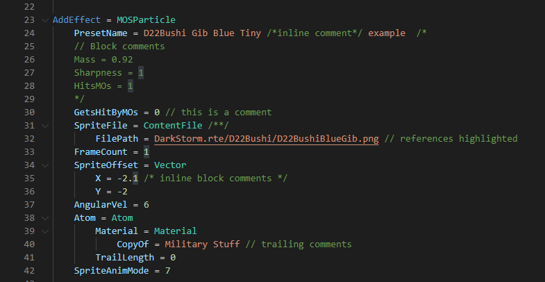
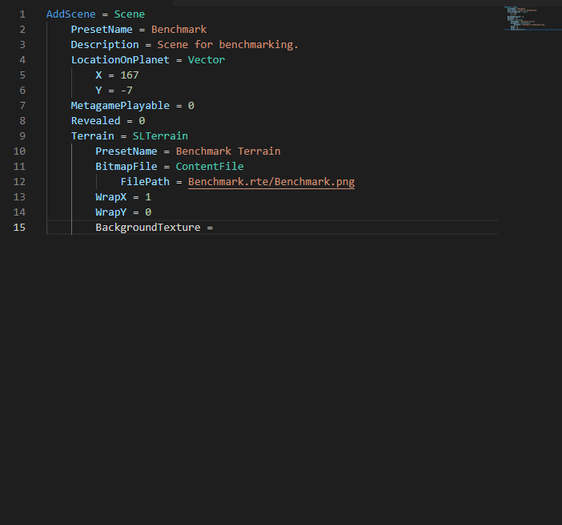
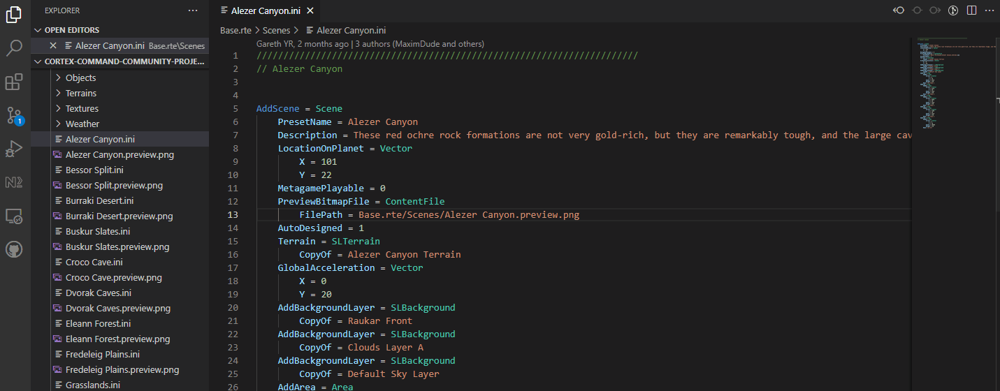

# Cortex Command Community Project Language Support

This extension is designed to support the development of content and mods for the game Cortex Command, specifically the open source community project.

## Features

Syntax highlighting, including support for:

- Keyword and class name recognition
- Comment , including block comments matching the project's format
- Module reference underlines

Code snippets for small classes, like ContentFile, Vector, Area etc.
These allow you to quicky create definitions for properties, and tab through their values.

Filepath validation of all references to module files within the workspace.
This currently requires the base game directory to be open as a VSCode workspace.

## Extension Settings

_NA (Not currently implemented)_
